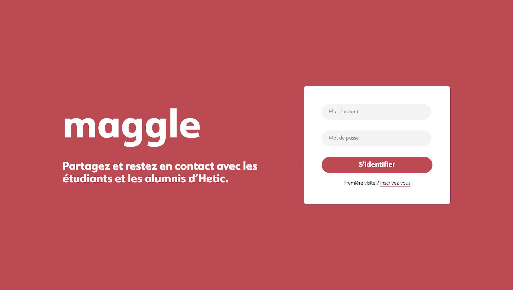

  

## Explications

### 1. Pourquoi 
Dans le cadre d'un projet dans notre [école](https://www.hetic.net/), nous avons eu pour exercice de faire un réseau social en back en groupe de 7.

### 2. Contraintes imposées
- Pouvoir se connecter / déconnecter / supprimer son compte / rendre son profil non visible
- Pouvoir modifier ses informations personnelles / photo de profil et de couverture
- Créer un groupe public ou privé avec possibilité de demander pour rejoindre le groupe et pouvoir y publier
- Créer une page avec possibilité de suivre la page
- Pouvoir ajouter / supprimer un ami / groupe / page
- Page d'accueil avec tous les messages
- Liker et commenter un post
- Bar de recherche pour pouvoir rechercher des personnes / pages / groupes
- Recevoir des notifications pour rejoindre un groupe / demande d'ami
- Publier un post
- Section pour envoyer des messages privés

## Technologies utilisées

### 1. Front

### 2. Back

### 3. Design

## Nos inspirations

- Messenger
- Facebook
- Twitter
